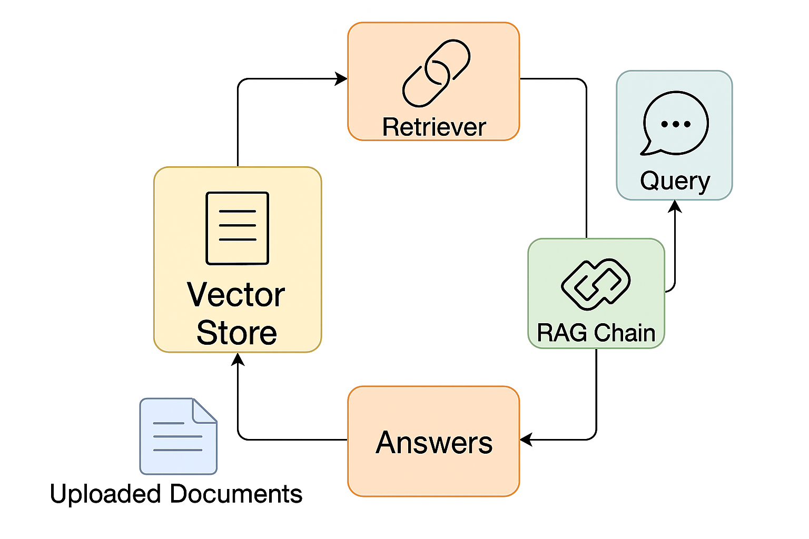
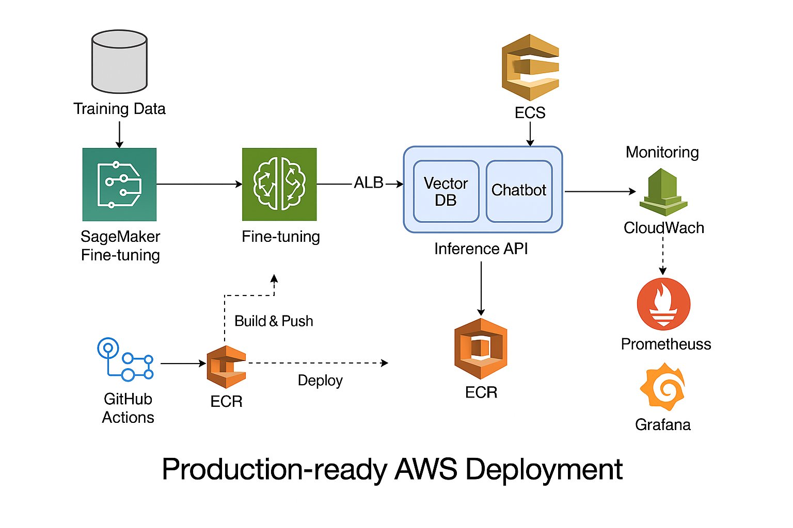
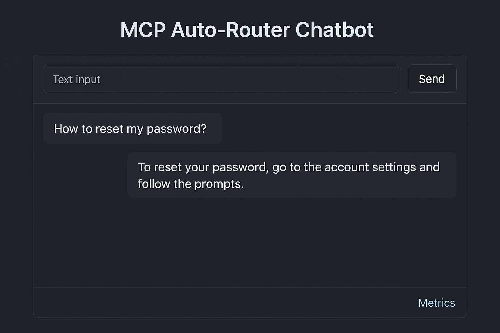
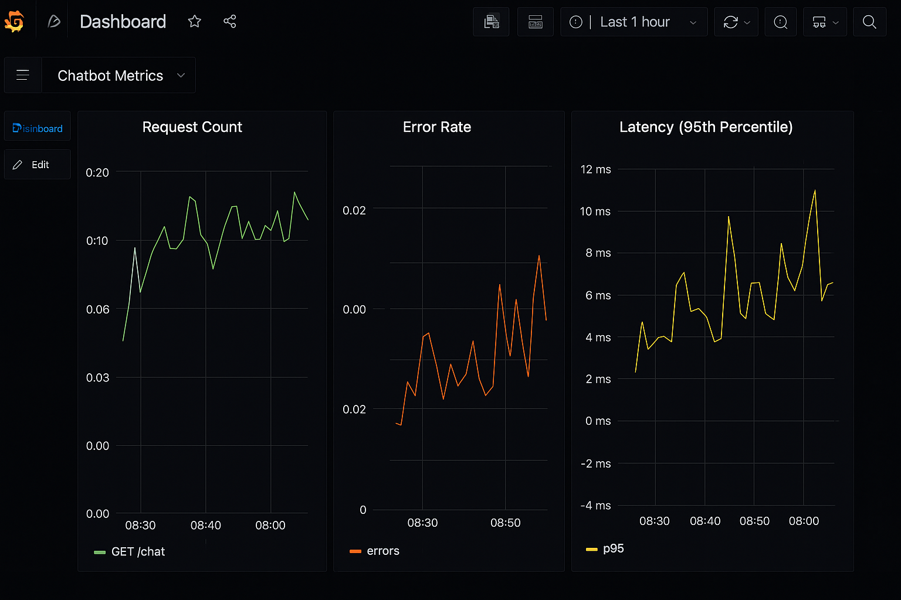

# MCP Auto-Router Chatbot – MLOps Version

[](https://www.python.org/)  
[](https://fastapi.tiangolo.com/)
[](https://github.com/eunki-7/mcp-auto-router-chatbot-mlops/actions)
[](https://huggingface.co/docs/transformers/index)
[](LICENSE)


This project demonstrates a **production-ready multi-component auto-router chatbot** enhanced with **MLOps practices**.  
It includes fine-tuning, CI/CD, containerized deployment, and production monitoring.

---

## Features
- **Auto-Router**: Dynamically routes queries to vector search or chatbot LLM based on context  
- **Vector Store (FAISS)**: Handles semantic search with embeddings  
- **Fine-tuning**: Supports HuggingFace model fine-tuning on custom data (SageMaker)  
- **MLOps Pipeline**: GitHub Actions CI/CD, Docker, and AWS CloudFormation infrastructure  
- **Monitoring**: Integrated Prometheus + Grafana dashboards for metrics  
- **Production-Ready Deployment** using AWS ECS (Fargate)

---

## Architecture


- **SageMaker Fine-tuning**: Model training and artifact storage in Amazon S3  
- **ECS Inference API**: FastAPI serving with auto-router and vector database  
- **CI/CD Pipeline**: GitHub Actions → ECR → ECS deployment  
- **Monitoring Stack**: CloudWatch, Prometheus, Grafana  
- **Vector DB**: FAISS embedded inside inference container for semantic routing

---

## Scalable AWS Deployment Architecture
- **ECR** stores container images  
- **ECS (Fargate)** hosts the inference service  
- **Application Load Balancer (ALB)** handles external traffic  
- **CloudWatch** captures logs and basic metrics  
- **Prometheus & Grafana** provide detailed request metrics and latency dashboards  
- **S3** manages training data and model artifacts  



---

## Production Considerations
- **Security**: IAM roles, secret management, TLS endpoints  
- **Scalability**: Containerized deployment, load-balanced ECS tasks  
- **Monitoring**: End-to-end observability with Prometheus, Grafana, and CloudWatch  
- **CI/CD**: GitHub Actions workflow for automated test and deploy  
- **Cost Optimization**: Fargate on-demand, minimal idle resources

---

## Source Code
[**📂 View on GitHub**](https://github.com/eunki-7/mcp-auto-router-chatbot-mlops)

---

## How It Works
1. User sends a text query via FastAPI endpoint  
2. Router decides:  
   - If matches known FAQ → Vector DB semantic search  
   - Else → LLM Chatbot generation  
3. Response returned with minimal latency  
4. Prometheus metrics collected for each endpoint and visualized in Grafana

---

## Tech Stack
- [FastAPI](https://fastapi.tiangolo.com/) – Inference API  
- [Transformers](https://huggingface.co/docs/transformers/index) – LLM & Embeddings  
- [FAISS](https://faiss.ai/) – Vector similarity search  
- [Prometheus](https://prometheus.io/) + [Grafana](https://grafana.com/) – Monitoring  
- AWS ECS, ECR, S3, SageMaker, CloudWatch

---

## Installation & Run (Local)
### 1) Environment Setup
```bash
git clone https://github.com/eunki-7/mcp-auto-router-chatbot-mlops.git
cd mcp-auto-router-chatbot-mlops
python3 -m venv venv
source venv/bin/activate   # Windows: venv\Scripts\activate
pip install -r requirements.txt
```

### 2) (Optional) VectorDB Initialization
```bash
python scripts/init_vectorstore.py
```
*(FAISS in-memory DB is used by default, so skipping is fine for basic testing)*

### 3) Start Application
```bash
uvicorn src.inference.main:app --host 0.0.0.0 --port 8000 --reload
```
- Swagger UI: [http://127.0.0.1:8000/docs](http://127.0.0.1:8000/docs)  
- Prometheus Metrics: [http://127.0.0.1:8000/metrics](http://127.0.0.1:8000/metrics)

### 4) (Optional) Monitoring Stack
```bash
cd monitoring
docker-compose up -d
```
- Prometheus: [http://localhost:9090](http://localhost:9090)  
- Grafana: [http://localhost:3000](http://localhost:3000) (admin / admin)

### 5) Tests
```bash
pytest tests/
```

---

## Deployment with AWS CloudFormation
### 1) Push Docker Image to ECR
```bash
./deployment/ci-cd/ecr_push.sh chatbot-repo ap-northeast-2
```
### 2) Deploy Network Stack
```bash
aws cloudformation deploy   --template-file cloudformation/network.yaml   --stack-name chatbot-network   --capabilities CAPABILITY_NAMED_IAM
```
### 3) Deploy ECS Cluster
```bash
aws cloudformation deploy   --template-file cloudformation/ecs-cluster.yaml   --stack-name chatbot-cluster   --capabilities CAPABILITY_NAMED_IAM
```
### 4) Deploy ECS Service
```bash
VPC_ID=$(aws cloudformation list-exports --query "Exports[?Name=='Chatbot-VPC'].Value" --output text)
SUBNET1=$(aws cloudformation list-exports --query "Exports[?Name=='Chatbot-Subnet1'].Value" --output text)
SUBNET2=$(aws cloudformation list-exports --query "Exports[?Name=='Chatbot-Subnet2'].Value" --output text)
ECR_IMAGE="<account_id>.dkr.ecr.ap-northeast-2.amazonaws.com/chatbot-repo:latest"

aws cloudformation deploy   --template-file cloudformation/ecs-service.yaml   --stack-name chatbot-service   --capabilities CAPABILITY_NAMED_IAM   --parameter-overrides     VPCId=$VPC_ID     PublicSubnet1Id=$SUBNET1     PublicSubnet2Id=$SUBNET2     ECRImage=$ECR_IMAGE
```
### 5) Deploy Monitoring Stack (Prometheus + Grafana)
```bash
aws cloudformation deploy   --template-file cloudformation/monitoring-stack.yaml   --stack-name chatbot-monitoring   --capabilities CAPABILITY_NAMED_IAM   --parameter-overrides     VPCId=$VPC_ID     PublicSubnet1Id=$SUBNET1     PublicSubnet2Id=$SUBNET2
```

---

## Example UI / Monitoring
### UI/UX Overview


### Grafana Dashboard


- Web interface served by FastAPI  
- Metrics available at `/metrics` endpoint

---

## Use Cases
- Enterprise knowledge base chatbots with routing logic  
- AI assistants combining FAQ search with generative models  
- MLOps demonstration (CI/CD, monitoring, scaling)

---

## Notes
- Initial request may take a few seconds due to model warm-up  
- Vector DB built in memory (FAISS) for simplicity, can be replaced with OpenSearch for large-scale production

---

## Author
**eunki7**  
- [GitHub Profile](https://github.com/eunki-7)
